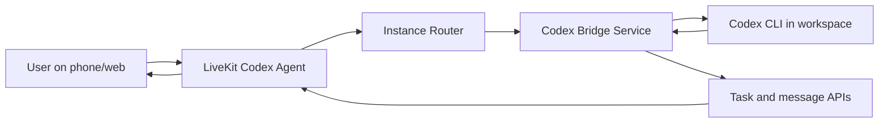

# Voice Codex Platform

Phone-first orchestration for Codex workers.

This repo demonstrates a practical control plane where a user can call or message, the system routes work to the right Codex-backed workspace, and results come back as human-friendly updates.

## Demo Video

DEMO VIDEO (GDRIVE): [link](https://drive.google.com/file/d/1q4QlnLx4LzqJObFrhyutj-TSbJ5dZGVL/view?usp=sharing)

or download the demo.MP4 video from the repo itself.

## What Is In This Repo

- `codex-bridge-service/`: FastAPI bridge that executes Codex tasks and exposes task/message APIs.
- `livekit-codex-agent/`: LiveKit voice agent with tool functions for routing, dispatch, and telephony.
- `docs/`: Product and architecture docs, including the platform plan.
- `instance-registry.example.json`: Safe template for multi-instance routing.

## Architecture

The implementation follows the platform direction in `docs/voice-codex-platform-plan.md`:

1. Voice/session intake: LiveKit room and voice interaction.
2. Orchestration and policy: route request to the correct instance/workspace.
3. Execution plane: Codex bridge runs `codex exec` in the selected workspace.
4. Result normalization: convert raw output into summaries, keywords, and messages.
5. Delivery: voice follow-up and task status/message endpoints.



## Runtime Flow

Canonical flow:

`User -> Voice Session -> Orchestrator -> Instance Adapter -> Codex Bridge -> Codex CLI -> Bridge Events -> Voice/Notification`

## Prerequisites

- Linux host with Python 3.10+.
- Codex CLI installed and authenticated on each worker machine.
- LiveKit project credentials.
- OpenAI API key for realtime model.

Optional for telephony:

- Twilio Elastic SIP Trunking credentials and phone numbers.

## Quick Start

### 1) Create environment

```bash
cd /home/ubuntu/hack
python3 -m venv .venv
.venv/bin/pip install -r codex-bridge-service/requirements.txt
.venv/bin/pip install -r livekit-codex-agent/requirements.txt
cp .env.example .env
```

### 2) Configure routing

- Copy `instance-registry.example.json` to `instance-registry.json` (or edit the existing file).
- Set each instance `bridge_base_url`, `workspace_path`, and `ssh_host`.

### 3) Start Codex bridge

```bash
cd /home/ubuntu/hack
.venv/bin/uvicorn codex-bridge-service.app:app --host 0.0.0.0 --port 8800
```

Health check:

```bash
curl -sS http://127.0.0.1:8800/health
```

### 4) Start LiveKit agent

```bash
cd /home/ubuntu/hack/livekit-codex-agent
../.venv/bin/python agent.py dev
```

## Environment Variables

Use `.env.example` as the source of truth. Main groups:

- Core: `OPENAI_API_KEY`, `LIVEKIT_URL`, `LIVEKIT_API_KEY`, `LIVEKIT_API_SECRET`.
- Realtime model: `OPENAI_REALTIME_MODEL`, `OPENAI_REALTIME_VOICE`.
- Bridge runtime: `CODEX_BIN`, `CODEX_BRIDGE_PUBLIC_BASE_URL`, `CODEX_BRIDGE_INLINE_CALLBACKS`.
- SIP telephony (optional): `TWILIO_SIP_*`, `LIVEKIT_SIP_*`.

## Task API Example

Dispatch a task:

```bash
curl -sS -X POST http://127.0.0.1:8800/api/v1/tasks/execute \
  -H 'Content-Type: application/json' \
  -d '{
    "prompt": "Inspect the docs folder and summarize platform architecture.",
    "workspace_path": "/home/ubuntu/hack",
    "sandbox": "read-only",
    "public_base_url": "http://127.0.0.1:8800"
  }'
```

Fetch status/messages:

```bash
curl -sS http://127.0.0.1:8800/api/v1/tasks/<task_id>
curl -sS http://127.0.0.1:8800/api/v1/tasks/<task_id>/messages
```

## Security Notes For Public Repos

- Never commit `.env` or `instance-registry.json` with real IPs/hosts.
- Keep only templates (`.env.example`, `instance-registry.example.json`) in git.
- Ignore generated runtime data under `*/data/` where user/task logs are written.

## Folder-Level READMEs

- `codex-bridge-service/README.md`: bridge API, execution details, and worker deployment.
- `livekit-codex-agent/README.md`: voice agent tools, routing behavior, and SIP operations.
