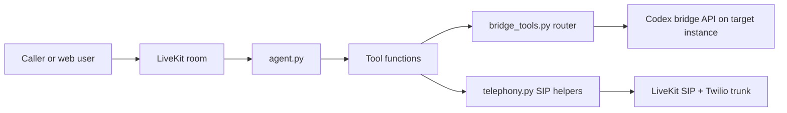

# LiveKit Codex Agent

Voice interface and orchestration worker for the Codex platform.

This service is the real-time intake + control layer. It speaks with the user, chooses a target instance, dispatches tasks to the bridge, and can manage SIP telephony through LiveKit.

## Architecture



## Core Responsibilities

- maintain conversational session context,
- expose tools to list/check instances,
- route and dispatch Codex requests,
- track latest task ID for follow-up status and responses,
- start outbound calls or provision SIP resources.

## Important Files

- `agent.py`: LiveKit entrypoint, tool registration, session boot flow.
- `bridge_tools.py`: instance registry loading, health checks, routing, bridge API client.
- `telephony.py`: Twilio SIP provisioning, room dispatch, outbound dialing.
- `prompts/system_prompt.txt`: assistant behavior and tool-use policy.

## Install

```bash
cd /home/ubuntu/hack
python3 -m venv .venv
.venv/bin/pip install -r livekit-codex-agent/requirements.txt
```

## Run Modes

Development worker:

```bash
cd /home/ubuntu/hack/livekit-codex-agent
../.venv/bin/python agent.py dev
```

Production-style worker:

```bash
cd /home/ubuntu/hack/livekit-codex-agent
../.venv/bin/python agent.py start
```

## SIP / Telephony Commands

Provision or update inbound/outbound SIP trunks and dispatch rule:

```bash
cd /home/ubuntu/hack/livekit-codex-agent
../.venv/bin/python agent.py provision-twilio-sip
```

Dispatch an outbound call (new room + agent dispatch):

```bash
cd /home/ubuntu/hack/livekit-codex-agent
../.venv/bin/python agent.py dial +14155550100 \
	--prompt "Call back with deployment status" \
	--intro "Hello, I am calling with your requested update."
```

## Environment Variables

This service loads `/home/ubuntu/hack/.env`.

Required core vars:

- `OPENAI_API_KEY`
- `OPENAI_REALTIME_MODEL` default: `gpt-realtime`
- `OPENAI_REALTIME_VOICE` default: `sage`
- `LIVEKIT_URL`
- `LIVEKIT_API_KEY`
- `LIVEKIT_API_SECRET`

Optional runtime vars:

- `LIVEKIT_AGENT_NAME` default: `codex-bridge-livekit`
- `LIVEKIT_SIP_ROOM_PREFIX` default: `codex-phone`
- `LIVEKIT_SIP_INBOUND_TRUNK_ID`
- `LIVEKIT_SIP_OUTBOUND_TRUNK_ID`
- `LIVEKIT_SIP_DISPATCH_RULE_ID`
- `LIVEKIT_SIP_INBOUND_TRUNK_NAME`
- `LIVEKIT_SIP_OUTBOUND_TRUNK_NAME`
- `LIVEKIT_SIP_DISPATCH_RULE_NAME`
- `LIVEKIT_SIP_MEDIA_ENCRYPTION`
- `LIVEKIT_SIP_TRANSPORT`
- `LIVEKIT_SIP_ROOM_EMPTY_TIMEOUT`
- `LIVEKIT_SIP_ROOM_MAX_PARTICIPANTS`

Twilio SIP vars:

- `TWILIO_SIP_AUTH_USERNAME`
- `TWILIO_SIP_AUTH_PASSWORD`
- `TWILIO_SIP_TERMINATION_URI`
- `TWILIO_SIP_INBOUND_NUMBERS`
- `TWILIO_SIP_OUTBOUND_NUMBERS`
- `TWILIO_SIP_PHONE_NUMBERS` fallback for both directions
- `TWILIO_SIP_ALLOWED_ADDRESSES`

## Routing Model

Routing is workspace-first via `instance-registry.json` at repo root.

- default target: `hack`
- heuristics: STT keywords -> `STT-A10`, TTS keywords -> `TTS-H100`
- action mode inferred from request text:
	write terms => `workspace-write`, otherwise `read-only`

This keeps voice UX simple while preserving deterministic execution boundaries.

## Safety and Ops Notes

- keep `instance-registry.json` private; commit only the example file.
- do not commit `.env` or SIP credentials.
- monitor bridge `/health` and task endpoints before live calls.
